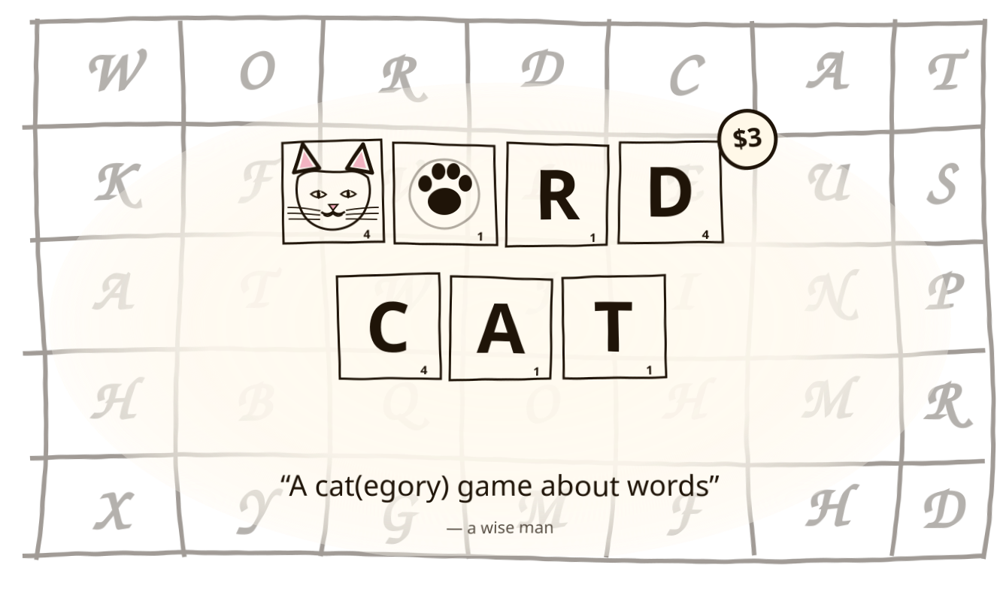

# WordCat

> *"A cat game about words."* — a wise man

<p align="center"></p>

A tile-based word game prototype (folder + package name: `tile-game`). No board — players draw from a shared pool of letter tiles and form a word that fits a category card. Each turn the player picks a difficulty tier (Easy / Medium / Hard) before drawing the card; harder tiers multiply the score.

Three modes:
- **Multiplayer** (2–6 players) — shareable invite link, real-time over WebSocket, with a lobby of open games.
- **Daily Challenge** — same shuffle for everyone each calendar day, one attempt, daily leaderboard.
- **Free Fire** — unlimited solo play with fresh shuffles.

## Stack
- Backend: FastAPI + SQLite (file-based, no external services)
- Frontend: React + Vite + Tailwind
- Auth: email/password (bcrypt + JWT) plus guest play

## Run

Backend (port 8100):
```bash
cd backend
python -m venv .venv && source .venv/bin/activate
pip install -e .
uvicorn app.main:app --port 8100 --reload
```

Frontend (port 5180):
```bash
cd frontend
npm install
npm run dev
```

Open http://localhost:5180.

## Data
- `backend/app/data/letter_values.json` — Scrabble-like letter point values (editable).
- `backend/app/data/tile_distribution.json` — letter frequencies for the ~150-tile shared pool.
- `backend/app/data/categories.json` — 44 categories tagged Easy / Medium / Hard.
- `backend/app/data/dictionary.txt` — English wordlist (one word per line).
- `backend/app/data/category_words/<id>.txt` — words that count for each category.

To regenerate per-category wordlists from curated seeds:
```bash
python scripts/seed_categories.py
```
